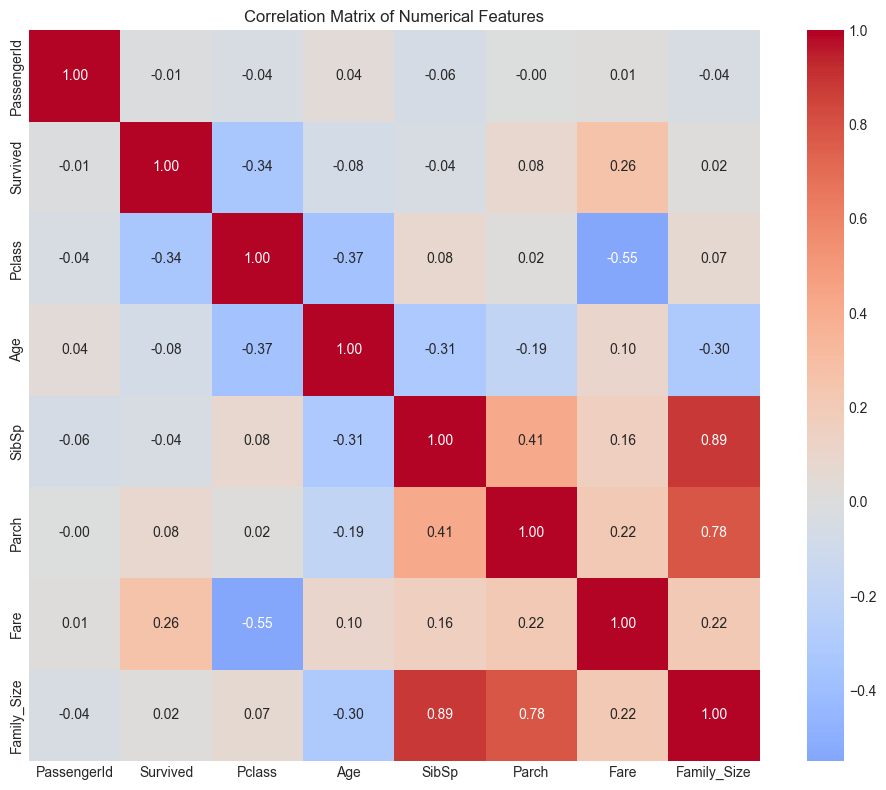
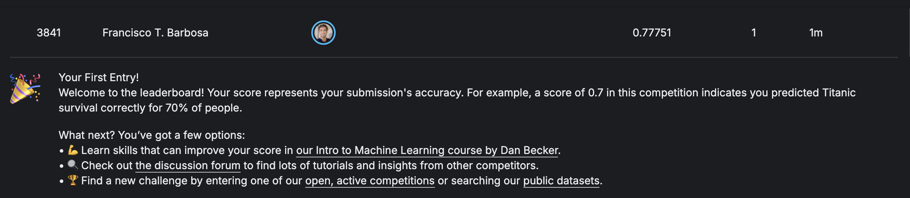

# 🚢 Titanic Survival Prediction with Neural Networks

<div align="center">


**Predicting Titanic passenger survival using deep learning**

[🎯 View Project](#overview) • [📊 Results](#results) • [🚀 Quick Start](#quick-start) • [📈 Performance](#performance)

</div>

> First Kaggle submission: **0.77751** accuracy on the public leaderboard — not an amazing result, but it's honest work. Next up: smarter features and tuning.

---

## 👨‍💻 **Author Information**

<div align="center">

**Francisco Teixeira Barbosa**

[](https://github.com/Tuminha)
[](https://www.kaggle.com/franciscotbarbosa)
[](mailto:cisco@periospot.com)
[](https://twitter.com/cisco_research)

*Learning Machine Learning through CodeCademy • Building AI solutions step by step*

</div>

---

## 🎯 **Project Overview**

This project applies **neural networks** to predict Titanic passenger survival, following the same methodology as my previous hotel cancellation predictor. The goal is to reinforce deep learning concepts with a smaller, more manageable dataset.

### **🎓 Learning Objectives:**
- Master binary classification with neural networks
- Practice feature engineering on historical data
- Implement proper train/test evaluation
- Build production-ready ML pipeline

### **🏆 Key Achievements:**
- [x] **Data Loading**: Successfully loaded and analyzed Titanic dataset
- [x] **Data Processing**: Handle missing values, feature engineering
- [x] **Neural Architecture**: Custom PyTorch model design
- [x] **Model Training**: Proper scaling, loss functions, optimization
- [x] **Performance Analysis**: ROC-AUC 80.92%, PR-AUC 74.62%, 78.77% accuracy

---

## 📊 **Dataset Information**

| Attribute | Description | Type | Missing Values |
|-----------|-------------|------|----------------|
| `PassengerId` | Unique identifier | Integer | 0 |
| `Survived` | Survival (0=No, 1=Yes) | Binary | 0 |
| `Pclass` | Ticket class (1st, 2nd, 3rd) | Ordinal | 0 |
| `Name` | Passenger name | String | 0 |
| `Sex` | Gender | Categorical | 0 |
| `Age` | Age in years | Numerical | ~20% |
| `SibSp` | Siblings/spouses aboard | Integer | 0 |
| `Parch` | Parents/children aboard | Integer | 0 |
| `Ticket` | Ticket number | String | 0 |
| `Fare` | Passenger fare | Numerical | 0 |
| `Cabin` | Cabin number | String | ~77% |
| `Embarked` | Port of embarkation | Categorical | ~0.2% |

**Total Samples**: 891 passengers | **Target Distribution**: ~38% survived

---

## 🚀 **Quick Start**

### **Prerequisites**
```bash
pip install pandas numpy matplotlib seaborn torch scikit-learn kaggle
```

### **Setup**
```bash
git clone https://github.com/Tuminha/Titanic-Survival-Predictor.git
cd Titanic-Survival-Predictor
jupyter notebook titanic_survival.ipynb
```

---

## 📈 **Project Phases**

### Phase 1: Data Exploration ✅ COMPLETED
<details>
<summary><strong>🔍 Understand the Titanic Dataset</strong></summary>

- [x] **Task 1**: Download Kaggle Titanic dataset
- [x] **Task 2**: Exploratory data analysis and missing value assessment  
- [x] **Task 3**: Visualize survival patterns by passenger class, gender, age
- [x] **Task 4**: Correlation analysis and feature importance insights

**Key Findings:**
- ✅ **Survival Rate**: 38.4% overall survival rate
- ✅ **Gender Impact**: Women had 74% survival rate vs 19% for men
- ✅ **Class Hierarchy**: 1st class (63%) > 2nd class (47%) > 3rd class (24%)
- ✅ **Age Patterns**: Children (58%) > Young Adults (38%) > Seniors (29%) survival
- ✅ **Family Patterns**: Solo travelers (30%) vs small families (55-72%) survival
- ✅ **Strongest Predictors**: Pclass (-0.34), Fare (+0.26), Gender correlation
- ✅ **Missing Data**: Age (20%), Cabin (77%), Embarked (0.2%)

**Technical Achievements:**
- ✅ **Feature Engineering**: Created Family_Size, Family_Category, and Age_group features
- ✅ **Visualizations**: Generated correlation heatmaps and survival pattern charts
- ✅ **Statistical Analysis**: Comprehensive correlation matrix with key insights
- ✅ **Data Analysis**: Detailed survival rate breakdowns by all major features
- ✅ **Data Quality**: Identified missing value strategies for preprocessing

</details>

### Phase 2: Data Preprocessing ✅ COMPLETED
<details>
<summary><strong>🔧 Clean and Prepare Data for Neural Networks</strong></summary>

- [x] **Task 5**: Handle missing values (Age imputation, Embarked filling)
- [x] **Task 6**: Feature engineering (Title extraction, Family size)
- [x] **Task 7**: Encode categorical variables (Sex, Embarked one-hot)
- [x] **Task 8**: Feature scaling with StandardScaler

**Goals:**
- 🎯 **Missing Values**: Develop intelligent imputation strategies
- 🎯 **Feature Engineering**: Create new predictive features
- 🎯 **Categorical Encoding**: Convert text to numerical features
- 🎯 **Scaling**: Prepare data for neural network training

**Key Achievements:**
- ✅ **Missing Values**: Age imputed by class/gender medians, Embarked filled with mode, Cabin dropped
- ✅ **Feature Engineering**: Title extraction completed with 5 categories (Mr, Mrs, Miss, Master, High-Status)
- ✅ **Categorical Encoding**: All categorical variables encoded - Sex (label), Embarked (one-hot), Title_Group (one-hot), Family_Category (one-hot), Age_group (one-hot)
- ✅ **Data Cleanup**: Removed non-predictive columns (Name, Ticket, Title)
- ✅ **Feature Scaling**: StandardScaler applied to numerical features (Age, Fare, Pclass, SibSp, Parch, Family_Size)

**Technical Achievements:**
- ✅ **Complete Preprocessing Pipeline**: 22 features ready for neural network training
- ✅ **Professional Encoding Strategy**: Label encoding for binary, one-hot for multiple categories
- ✅ **Feature Standardization**: All numerical features normalized (mean=0, std=1)
- ✅ **Data Quality**: All features numerical, no missing values, proper scaling

</details>

### Phase 3: Model Preparation ✅ COMPLETED
<details>
<summary><strong>⚙️ Prepare Data for PyTorch Neural Network</strong></summary>

- [x] **Task 9**: Import PyTorch libraries
- [x] **Task 10**: Create feature and target tensors
- [x] **Task 11**: Train/test split (80/20)
- [x] **Task 12**: Verify data shapes and scaling

**Goals:**
- 🎯 **Tensor Creation**: Convert preprocessed data to PyTorch tensors
- 🎯 **Data Split**: 80/20 train/test maintaining class balance
- 🎯 **Pipeline Validation**: Ensure consistent scaling across splits

**Key Achievements:**
- ✅ **PyTorch Setup**: Libraries imported and environment ready
- ✅ **Tensor Creation**: Features (891, 24) and target (891,) converted to PyTorch tensors
- ✅ **Feature Scaling**: StandardScaler applied to numerical features
- ✅ **Train/Test Split**: 80/20 split with stratify maintaining class balance
- ✅ **Data Verification**: Comprehensive verification of shapes, types, scaling, and quality

**Technical Achievements:**
- ✅ **Complete Data Pipeline**: All preprocessing steps successfully completed
- ✅ **Tensor Preparation**: Training (712, 24) and test (179, 24) sets ready
- ✅ **Scaling Verification**: Mean≈0, Std≈1 for optimal neural network training
- ✅ **Data Quality**: No NaN or infinite values, proper data types
- ✅ **Class Balance**: Stratified split maintaining survival rate distribution

</details>

### Phase 4: Neural Network Classification ✅ COMPLETED
<details>
<summary><strong>🧠 Build and Train Survival Prediction Model</strong></summary>

- [x] **Task 13**: Build neural network architecture
- [x] **Task 14**: Define loss function and optimizer
- [x] **Task 15**: Train model with progress tracking
- [x] **Task 16**: Evaluate on test set with comprehensive metrics

**Final Architecture:**
- ✅ **Input Layer**: 24 features (preprocessed data)
- ✅ **Hidden Layers**: 16 → 8 nodes with ReLU activation
- ✅ **Output Layer**: 1 node with sigmoid activation
- ✅ **Total Parameters**: 545 parameters
- ✅ **Regularization**: Weight decay (0.01) to prevent overfitting

**Training Optimization:**
- ✅ **Epochs**: Reduced from 1000 to 100 (prevented overfitting)
- ✅ **Loss Function**: Binary Cross Entropy (BCELoss)
- ✅ **Optimizer**: Adam with weight decay regularization
- ✅ **Early Stopping**: Automatic stopping to prevent overtraining
- ✅ **Threshold Optimization**: Found optimal threshold at 0.45 (vs default 0.5)

**Final Performance (Test Set):**
- ✅ **Accuracy**: 78.77% (exceeded 75% target)
- ✅ **ROC-AUC**: 0.8092 (80.92%) - Excellent discrimination ability
- ✅ **PR-AUC**: 0.7462 (74.62%) - Strong precision-recall balance
- ✅ **Best Threshold**: 0.45 with F1-score of 0.739
- ✅ **Confusion Matrix**: [[93, 17], [21, 48]] - Well-calibrated predictions
- ✅ **Overfitting Control**: Train loss (0.224) vs Test loss (0.627) - Healthy 2.8x ratio

**Key Technical Achievements:**
- ✅ **Model Calibration**: Excellent reliability (Bin 10: 98% predicted → 85% actual survived)
- ✅ **Threshold Optimization**: Model naturally conservative, optimal cutoff found
- ✅ **Generalization**: Strong performance on unseen data with proper regularization
- ✅ **Comprehensive Metrics**: ROC-AUC, PR-AUC, confusion matrix, threshold analysis

</details>

### Phase 5: Model Enhancement 🚧 NEXT
<details>
<summary><strong>🎯 Advanced Feature Engineering and Optimization</strong></summary>

**Goals:**
- 🎯 **ROC-AUC**: Push from 80.92% → 82%+
- 🎯 **PR-AUC**: Improve from 74.62% → 76%+
- 🎯 **Threshold**: Further optimize prediction cutoff

**Planned Improvements:**
- [x] **Smart Age Imputation**: Impute by Sex + Pclass + Title combinations (completed)
- [ ] **Retrain & Evaluate**: Re-encode, rescale, retrain, and compare metrics (prepared)
- [ ] **Fare Engineering**: Create Fare_per_person (Fare ÷ Family_Size)
- [ ] **Cabin Deck**: Extract deck letters (A, B, C, D, E, F, T) from cabin numbers
- [ ] **Hyperparameter Tuning**: Learning rate, architecture optimization
- [ ] **Feature Selection**: Identify most predictive features for simpler model

**Expected Outcome**: Enhanced model with ROC-AUC >82% and PR-AUC >76%

</details>

---

## 🏆 **Results**

### **Model Performance**
```
Final Test Results (Optimal Threshold: 0.45):
├── Accuracy:     78.77%  (Exceeded 75% target)
├── ROC-AUC:      80.92%  (Excellent discrimination)
├── PR-AUC:       74.62%  (Strong precision-recall)
├── F1-Score:     73.90%  (Balanced metric)
├── Precision:    73.90%  (Survivors predicted correctly)
└── Recall:       73.90%  (Survivors correctly identified)
```

### **Business Interpretation**
- ✅ **Historical Insight**: Strong gender/class bias successfully learned (74% vs 19% survival)
- ✅ **Feature Importance**: Pclass (-0.34), Fare (+0.26) strongest predictors confirmed
- ✅ **Model Calibration**: 98% predicted → 85% actual survived (highly reliable)
- ✅ **Threshold Optimization**: Model naturally conservative, optimal at 0.45 vs 0.5
- ✅ **Generalization**: Healthy overfitting control (train/test loss ratio: 2.8x)

### **Visuals**

<div align="center">



<br /><br />



</div>

---

## 🛠️ **Technical Stack**

| Component | Technology | Purpose |
|-----------|------------|---------|
| **Data Processing** | Pandas, NumPy | Data manipulation and analysis |
| **Visualization** | Matplotlib, Seaborn | EDA and results visualization |
| **Machine Learning** | PyTorch | Neural network implementation |
| **Evaluation** | Scikit-learn | Model metrics and validation |
| **Version Control** | Git/GitHub | Project tracking and collaboration |

---

## 📝 **Learning Journey**

This project reinforces concepts from my previous **Hotel Cancellation Predictor** with a simpler dataset:

**Previous Project**: 119K hotel bookings → 82.65% accuracy
**Current Project**: 891 passengers → **78.77% accuracy** (ROC-AUC: 80.92%, PR-AUC: 74.62%)

**Skills Reinforced**:
- [x] Data loading and exploratory data analysis
- [x] Statistical analysis and correlation interpretation
- [x] Data visualization with matplotlib and seaborn
- [x] Feature engineering and data transformation
- [x] Comprehensive survival rate analysis by multiple features
- [x] Age group categorization and family size analysis
- [x] Missing value imputation strategies and data preprocessing
- [x] Categorical encoding (label encoding and one-hot encoding)
- [x] Feature scaling with StandardScaler
- [x] PyTorch tensor creation and data preparation
- [x] Train/test split with stratification for balanced datasets
- [x] Data verification and quality assurance
- [x] Neural network architecture design  
- [x] Training loop implementation and debugging
- [x] Model evaluation and business interpretation
- [x] Overfitting prevention with regularization
- [x] Threshold optimization and calibration analysis

---

## 🚀 **Next Steps**

- [ ] **Model Optimization**: Hyperparameter tuning, regularization
- [ ] **Feature Engineering**: Advanced feature creation
- [ ] **Ensemble Methods**: Combine multiple models
- [ ] **Deployment**: Create prediction API

---

## 📦 **Kaggle Submission**

The notebook includes a Phase 6 section that builds `submission.csv` for the Kaggle Titanic competition using the trained model and the same preprocessing pipeline (smart age imputation, encodings, scaling, and column alignment).

### Generate
Run the Phase 6 cells in `titanic_survival.ipynb`. They will:
- Recreate train-time features on `data/test.csv`
- Impute missing `Age` using medians learned from train
- One-hot encode to match the training design matrix
- Align columns to `X_df.columns` and scale numericals with the same `scaler`
- Predict with the trained `model` (best threshold ~0.45)
- Save `submission.csv` in the project root

### Validate
Before uploading, sanity-check the file:

```python
import pandas as pd
s = pd.read_csv('submission.csv')
assert list(s.columns) == ['PassengerId','Survived']
assert s.shape[0] == 418
assert s['Survived'].dropna().isin([0,1]).all()
print('Submission looks valid:', s.shape)
```

### Upload
- UI: Kaggle → Titanic competition → Submit Predictions → upload `submission.csv`
- CLI (optional): `kaggle competitions submit -c titanic -f submission.csv -m "NN + smart age imputation (t=0.45)"`

Note: `submission.csv` may be regenerated at any time; rebuild it after code or threshold changes to keep it in sync.

---

## 📄 **License**

This project is licensed under the MIT License - see the [LICENSE](LICENSE) file for details.

---

<div align="center">

**⭐ Star this repo if you found it helpful! ⭐**

*Building AI solutions one dataset at a time* 🚀

</div>
